# Nekobox指南

## 下载Nekobox

在[此处](https://github.com/MatsuriDayo/nekoray/releases)下载适用于自己电脑系统的最新版软件

## 开始使用

本软件不需要安装，直接解压到任意位置，双击运行`nekoray.exe`

第一次运行时会出现下面这个窗口，请选择`sing-box`核心

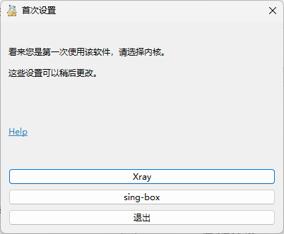

进入软件首页

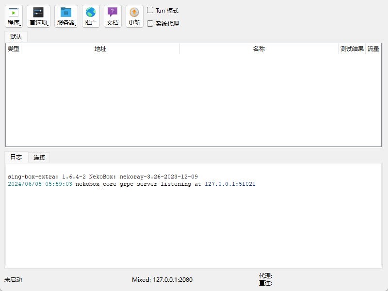

进入`首选项-分组-新建分组`，类型选择订阅，输入分组名字和订阅链接，点击确定

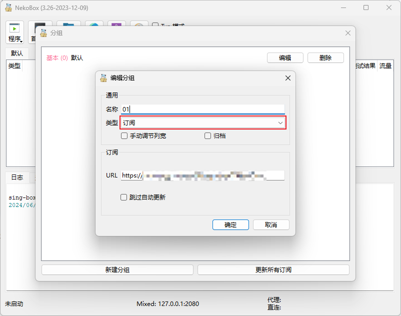

更新订阅

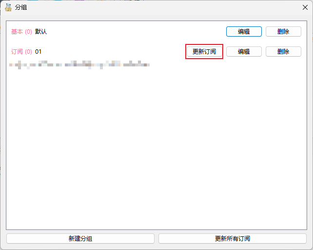

点击`服务器-当前分组-Url Test`（快捷键Ctrl+Shift+U），测试节点的延迟

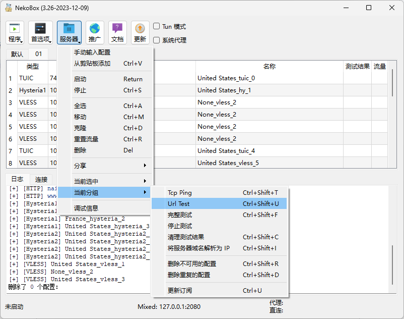

测试完成后，点击测试结果，可按延迟排序

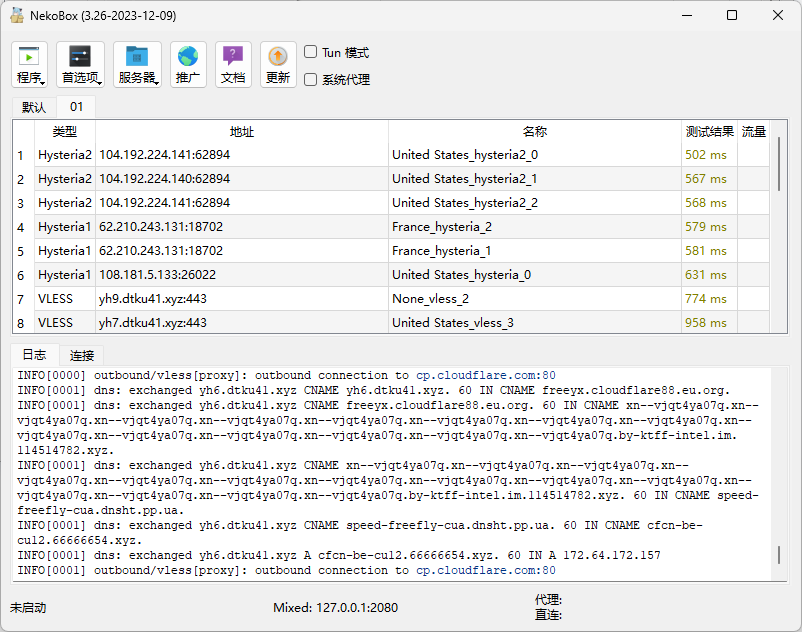

勾选系统代理，选择一个节点，回车启动

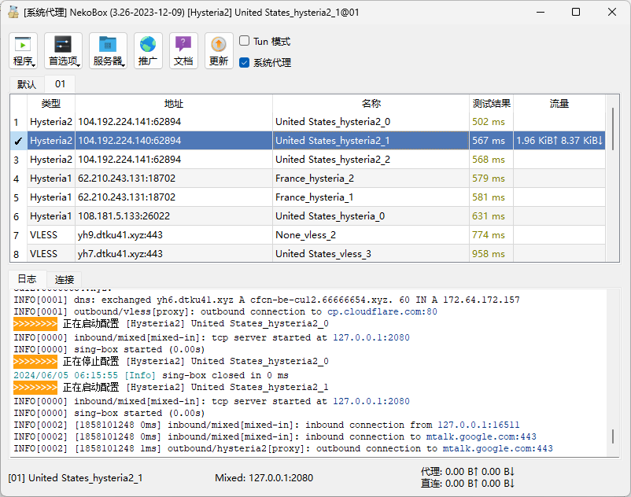

打开浏览器，访问任意外网，如谷歌，测试是否连接成功

使用结束后，Ctrl+S停止代理，**并取消勾选系统代理**

## 路由设置

点击`首选项-路由设置`打开路由设置界面

在管理路由规则这里可以配置自己的路由集

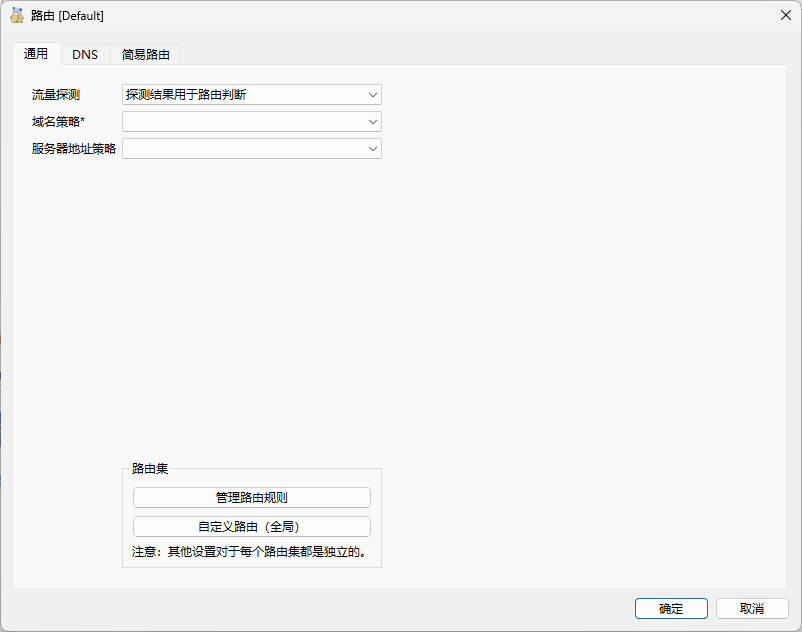

在简易路由这里可以配置自己的路由规则，软件默认提供了两种预设，分别是全局和绕过局域网和大陆。对于不在列表里的域名/ip，将采用右下角的默认出站，默认出站proxy代表代理，bypass代表直连，block代表阻止

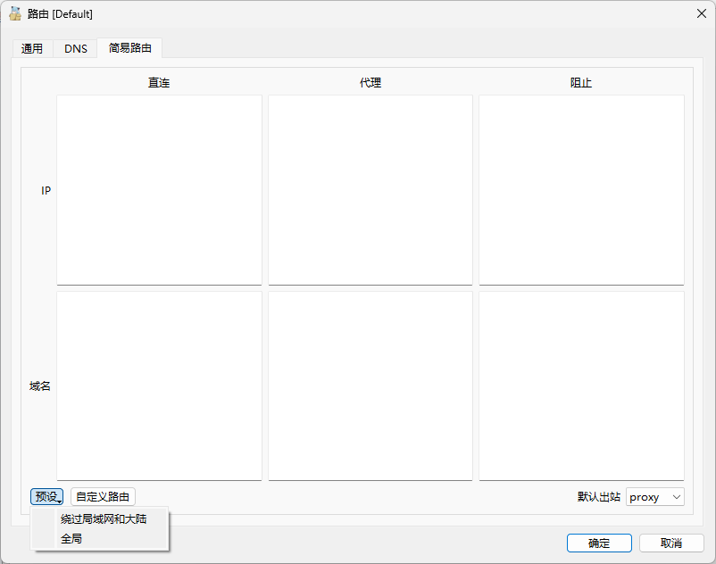

对于不在预设里的域名或者ip，可以自行添加相关规则，规则的写法见[这里](https://matsuridayo.github.io/m-route/)

## 注意事项

### 一、重启电脑后浏览器无法上网？

软件用完后请关闭系统代理，如果关机时没有关闭系统代理，下次启动时会遇到浏览器无法上网的问题

#### 解决方法：

**方法一：**打开电脑设置`网络和Internet-代理-手动设置代理-使用代理服务器`，点击`编辑`，关闭`使用代理服务器`

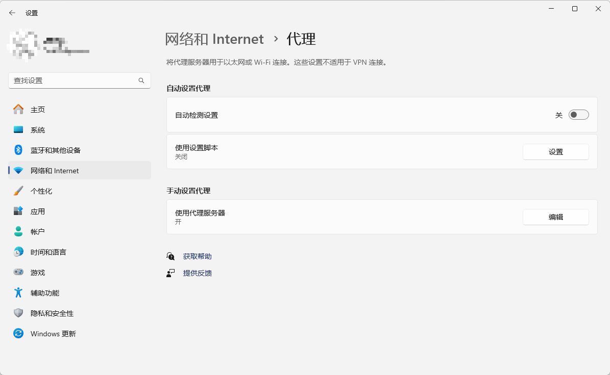

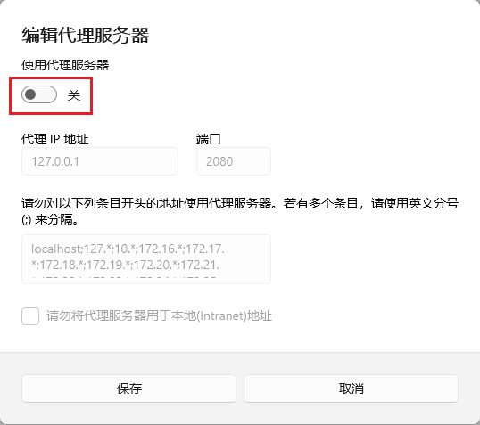

**方法二：**打开NekoBox软件，双击系统代理旁边的复选框（打开又关闭）

### 二、如何创建桌面快捷方式？

打开软件所在目录，右键`nekoray.exe`，点击`发送到-桌面快捷方式`

### 三、如何共享代理给其他设备使用？

1. 启动代理，点击`程序-允许其他设备连接`

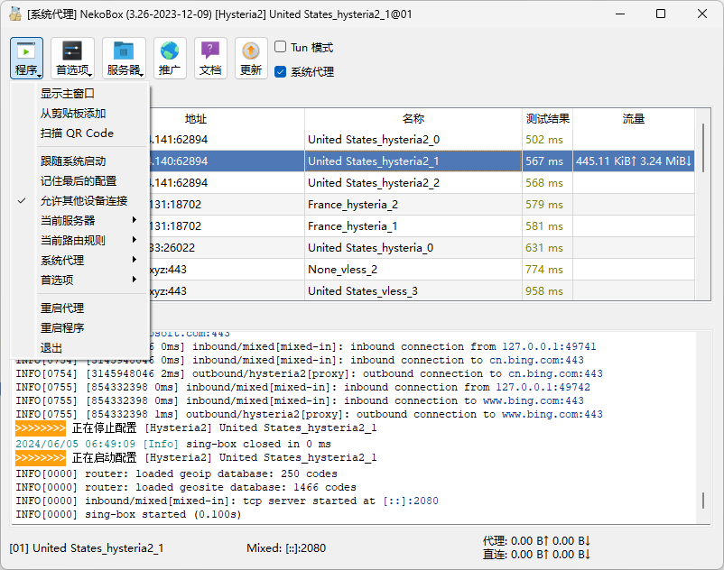

2. 点击`首选项-基本设置`，查看端口号（默认是2080）

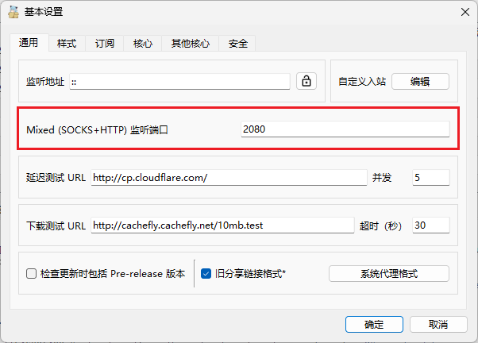

3. 打开电脑热点，打开Windows终端 / Powershell / CMD，输入`ipconfig /all`，找到电脑热点所使用的ip地址，可以得到类似下面的输出，记住里面的 IPv4 地址

   ```(空)
   无线局域网适配器 移动热点:
   
      连接特定的 DNS 后缀 . . . . . . . :
      描述. . . . . . . . . . . . . . . : Microsoft Wi-Fi Direct Virtual Adapter #4
      物理地址. . . . . . . . . . . . . : CE-D9-AC-8A-32-CF
      DHCP 已启用 . . . . . . . . . . . : 否
      自动配置已启用. . . . . . . . . . : 是
      本地链接 IPv6 地址. . . . . . . . : fe80::714:3599:d375:5854%7(首选)
      IPv4 地址 . . . . . . . . . . . . : 192.168.137.1(首选)
      子网掩码  . . . . . . . . . . . . : 255.255.255.0
      默认网关. . . . . . . . . . . . . :
      TCPIP 上的 NetBIOS  . . . . . . . : 已启用
   ```

4. 打开你需要共享代理的设备，连接电脑热点，这里以安卓手机为例，具体不同设备操作可能略有不同。长按电脑热点名字，点击修改网络，在高级选项中，代理选择手动，服务器主机名填入第3步的 IPv4 地址，服务器端口填入第2步所示端口，点击保存

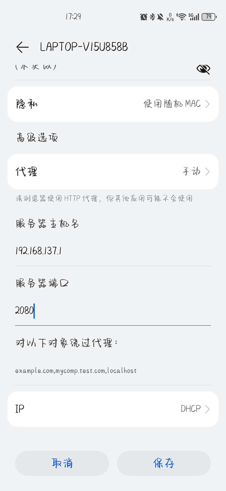

### 四、还有其他问题？

请点击软件主界面的文档查看帮助
